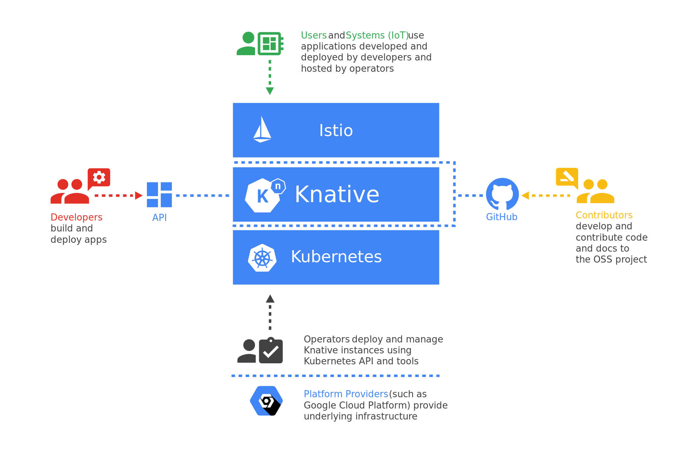

## Introduction
Knative is an open source framework that provides a collection of components that extend Kubernetes. Currently, Knative offers three components: Serving, Build, and Eventing.
The three components could be described as follows:
- Serving is base on Kubernetes and Istio, provides the possibility to deploy and serving of functions and serverless applications. It includes a automatic scale-to-zero function.
- Build provides building block for creating container images from source code. The source code could be provided from different soruces (git, gce, custom).
- Eventing provides blocks for consuming and producing events to bind event sources to services.
- Knative is developed for different target groups the following diagram gives an overview:


- Developers: Knative components offer developers Kubernetes-native APIs for deploying serverless-style functions, applications, and containers to an auto-scaling runtime.¹
- Operators: Knative components are intended to be integrated into more polished products that cloud service providers or in-house teams in large enterprises can then operate. Any enterprise or cloud provider can adopt Knative components into their own systems and pass the benefits along to their customers.
- Contributors: With a clear project scope, lightweight governance model, and clean lines of separation between pluggable components, the Knative project establishes an efficient contributor workflow

## Istio
- First, we need to install Istio. This will be done by the following commands. 
- It will take some seconds to get all services in the running state.
```
kubectl apply --filename https://github.com/knative/serving/releases/download/v0.4.0/istio-crds.yaml && \\
kubectl apply --filename https://github.com/knative/serving/releases/download/v0.4.0/istio.yaml
```

- Next, we need to label the default namespace with istio-injection=enabled. 
- This activates Istio on the “default” Kubernetes namespace and injects automatically an Istio proxy sidecar container to all pods deployed to the this namespace.
```
kubectl label namespace default istio-injection=enabled
```
To check whether all Istion components are in Running state, execute the following command:
```
kubectl get pods --namespace istio-system
```

It will take a few minutes until all components are started.

## Install Knative
At this stage our Istio service mesh is running and we are ready to install Knative. The following command must be executed without any error.

- To install Knative, first install the CRDs by running the kubectl apply command once with the -l knative.dev/crd-install=true flag. This prevents race conditions during the install, which cause intermittent errors:
```
kubectl apply --selector knative.dev/crd-install=true \
--filename https://github.com/knative/serving/releases/download/v0.11.0/serving.yaml \
--filename https://github.com/knative/eventing/releases/download/v0.11.0/release.yaml \
--filename https://github.com/knative/serving/releases/download/v0.11.0/monitoring.yaml
```
- To complete the install of Knative and its dependencies, run the kubectl apply command again, this time without the --selector flag, to complete the install of Knative and its dependencies:
```
kubectl apply --filename https://github.com/knative/serving/releases/download/v0.11.0/serving.yaml \
--filename https://github.com/knative/eventing/releases/download/v0.11.0/release.yaml \
--filename https://github.com/knative/serving/releases/download/v0.11.0/monitoring.yaml
```
Monitor the Knative components until all of the components show a STATUS of Running:
```
kubectl get pods --namespace knative-serving
kubectl get pods --namespace knative-eventing
kubectl get pods --namespace knative-monitoring
```

## Deploy an App with Knative
After the installation of Istio and Knative we can start to deploy a serverless application. In this case we will deploy a go hello-world example by use of the serving component.
For our example we will use the “default” namespace in the Kubernetes cluster. If you like to use another namespace you can create one by the following command and edit the metadata in the example file below.
```
kubectl create ns hello-world
```

We need to create yaml-file for our application with the following content.

```
apiVersion: serving.knative.dev/v1alpha1 # Current version of Knative
kind: Service
metadata:
  name: helloworld-go # The name of the app
  namespace: default # The namespace the app will use
spec:
  template:
    spec:
      containers:
        - image: gcr.io/knative-samples/helloworld-go # The URL to the image of the app
          env:
            - name: TARGET # The environment variable printed out by the sample app
              value: "Go Sample v1"
```
With the created namespace and the yaml-file we are ready to deploy our app by the use of kubectl apply.

```
kubectl apply --filename hellmworld.yaml
```
Our service is ready to interact we need to find the public IP-address of the gateway. We use the kubectl get service command in our case we don’t have an external load balancer we will use NodePorts.

## Interacting with the app
To see if your app has been deployed successfully, you need the host URL and IP address created by Knative.

Note: If your cluster is new, it can take some time before the service is assigned an external IP address.

- To find the IP address for your service, enter:
```
# In Knative 0.2.x and prior versions, the `knative-ingressgateway` service was used instead of `istio-ingressgateway`.
INGRESSGATEWAY=knative-ingressgateway

# The use of `knative-ingressgateway` is deprecated in Knative v0.3.x.
# Use `istio-ingressgateway` instead, since `knative-ingressgateway`
# will be removed in Knative v0.4.
if kubectl get configmap config-istio -n knative-serving &> /dev/null; then
    INGRESSGATEWAY=istio-ingressgateway
fi

kubectl get svc $INGRESSGATEWAY --namespace istio-system
```

The command will return something similar to this:
```
   NAME                     TYPE           CLUSTER-IP     EXTERNAL-IP      PORT(S)                                      AGE
   istio-ingressgateway   LoadBalancer   10.23.247.74   35.203.155.229   80:32380/TCP,443:32390/TCP,32400:32400/TCP   2d
```
Take note of the EXTERNAL-IP address.

You can also export the IP address as a variable with the following command:
```
   export IP_ADDRESS=$(kubectl get svc $INGRESSGATEWAY --namespace istio-system --output 'jsonpath={.status.loadBalancer.ingress[0].ip}')

```

To find the host URL for your service, enter:
```
kubectl get route helloworld-go  --output=custom-columns=NAME:.metadata.name,URL:.status.url
```

Now you can make a request to your app and see the results. Replace IP_ADDRESS with the EXTERNAL-IP you wrote down, and replace helloworld-go.default.example.com with the domain returned in the previous step.

```
curl -H "Host: helloworld-go.default.example.com" http://${IP_ADDRESS}
```
